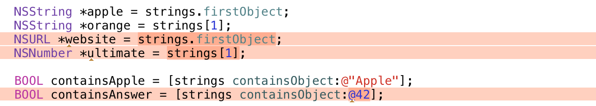

Statically typed Objective-C collections <a href="https://flattr.com/submit/auto?user_id=Tricertops&url=https%3A%2F%2Fgithub.com%2FiMartinKiss%2FTyped" target="_blank"></a>
=============================
Do you like typed arrays in Swift (or other languages)? Would you like to have them in Objective-C? Now you can.




Typed Collections
-----------------
  - **_TArray_**, _TMutableArray_
  - **_TSet_**, _TMutableSet_, _TCountedSet_
  - _TOrderedSet_, _TMutableOrderedSet_
  - **_TDictionary_**, _TMutableDictionary_
  - _TCache_
 
These typed collection are **parametrized drop-in replacements** for Foundation classes: `NSArray`, `NSSet`, `NSDictionary` and more. Their parameters are the element class you wish to store, for example `TArray(NSString)`. Associative collections take two parameters, one for keys and one for values, for example `TDictionary(NSString, NSURL)`.

> These collections, in fact, only exists at compiler level since they are just alternative interfaces for the underlying Foundation collections.

However, for **every element class** or association class pair you plan to use, you’ll need to generate the appropriate interfaces using a macro:

```objc
// Typically in .h file
TGenerate(NSString,*)
TAssociativeGenerate(NSString,*, NSURL,*)
```

> **Note:** The pointer star have to be included for pointer types **after a comma**. This ugly requirement is needed for supporting for non-pointer types.

Typed version of the basic foundation classes are already provided.

Alternatively, you can use `typedef`’d variants in a form of `NSStringArray`, `NSNumberMutableSet` or `NSStringToNSNumberDictionary`. All these types are written without the pointer star `*`.

### Casting
Objects stored as typed collections type are in fact Foundation collections (`NSArray`, `NSSet`, `NSDictionary`, …). The type-checking trick is made at **compile-time** using customized protocol interface.

You can store any `NSArray` in variable of _TArray_ type, but you have to **cast** it:

```objc
TArray(NSString) strings = (TArray(NSString))objects;
TArray(NSString) strings = (TArray(NSString))@[ @"Apple", @"Orange", @"Pear" ];
```

When not doing so, the compiler will **emit a warning**:

```objc
// Warning: Incompatible pointer types 3×:
TArray(NSString) strings = objects;
TArray(NSString) strings = @[ @"Apple", @"Orange" ];
TArray(NSString) strings = (TArray(NSNumber))objects;
```

Such casting makes **no** static (nor dynamic) type-checking, so you have to be sure the array contains only instances of given class.

You can use the typed collections in place of Foundation collections **without any casting**:

```objc
TSet(NSString) strings = ...
NSSet *objects = strings;
```

### Creating
Every typed collection has an allocation macro, that returns a new instance, but you **need to call `-init...`** method just like when allocating manually. Initialization methods are already type-checked against the element class:

```objc
TArray(NSString) strings = [TArrayAlloc(NSString) initWithObjects:@"Apple", nil];
```

In addition, every typed collection provides a convenience constructor with static type-checking of every element:

```objc
TSet(NSString) strings = TSetMake(NSString, @"Apple", @"Orange", @"Pear");
```

```objc
// Warning: Incompatible pointer types:
TArray(NSString) strings = TArrayMake(NSString, @"Apple", @42);
```

For _TDictionary_, the constructor is a bit more complicated, since it needs two types. You specify the pairs using _TPair_ macro, which should be used **only in this case**:

```objc
TDictionaryMake(NSString, NSNumber,
                TPair(@"Apple", @5),
                TPair(@"Orange", @2),
                TPair(@"Pear", @4));
```

```objc
// Warning: Incompatible pointer types 3×:
TDictionaryMake(NSString, NSNumber,
                TPair(@"Apple", @"5"),
                TPair(@2, @"Orange"),
                TPair(@"Pear", [NSDate new]));
```

### Methods
Typed collections have **exact** the same interface as their Foundation counterparts, but all occurences of `id` are **replaced with the class** of the elements (or associative keys and values). Also, all collection parameters (or return values) are **converted to typed** collections.

```objc
- (NSString *)objectAtIndex:(NSUInteger)index;
- (BOOL)containsObject:(NSString *)object;
- (TArray(NSString))arrayByAddingObjectsFromArray:(TArray(NSString))otherArray;
```

```objc
- (NSURL *)objectForKey:(NSString *)key;
@property (readonly, copy) TArray(NSURL) allValues;
- (TArray(NSString))allKeysForObject:(NSURL *)object;
```

**There is no implementation.** The method calls will be dispatched to their untyped variants at runtime.

### Nesting
All typed collection support nesting, which means, you can have an _array of arrays of strings_ or a _dictionary with string keys and array of string values_ and all methods are typed to an arbitrary level of depth (see examples).

```objc
TArray(TArray(NSString)) table = ...
TDictionary(NSString, TArray(NSString)) keywords = ...
```

These nested types also have to be generated before being used:

```objc
TGenerate(TArray(NSString),)
TAssociativeGenerate(NSString,*, TArray(NSString),)
```

> **Note 1:** There must already be `TGenerate(NSString)` before this.  
> **Note 2:** Typed collections have no pointer star, since they are derived from `id`.


Typed Examples
--------------
> You can find these code examples in `Test/main.m`.

**Accessing** objects in a typed array:

```objc
NSString *apple = strings.firstObject;
NSString *orange = strings[1];
```

```objc
// Warning: Incompatible pointer types 2×:
NSURL *websiteURL = strings.firstObject;
NSNumber *ultimateAnswer = strings[1];
```

**Enumerating** using for-in macro that infers the type:

```objc
TForIn(fruit, strings) {
    NSString *lowercase = fruit.lowercaseString;
}
```

```objc
TForIn(fruit, strings) {
    // Warning: Incompatible pointer types:
    NSURL *host = fruit.host;
}
```

**Finding** objects in a typed array:

```objc
BOOL containsApple = [strings containsObject:@"Apple"];
NSUInteger orangeIndex = [strings indexOfObject:@"Orange"];
```

```objc
// Warning: Incompatible pointer types 2×:
BOOL containsUltimateAnswer = [strings containsObject:@42];
NSUInteger websiteURLIndex = [strings indexOfObject:websiteURL];
```

**Deriving** new typed arrays:

```objc
strings = [strings copy];
strings = [strings arrayByAddingObject:@"Peach"];
strings = [strings subarrayWithRange:NSMakeRange(0, 3)];
```

```objc
// Warning: Incompatible pointer types 3×:
TArray(NSURL) URLs = [strings copy];
TArray(NSDate) dates = [strings arrayByAddingObject:@"Peach"];
TArray(NSNumber) answers = [strings subarrayWithRange:NSMakeRange(0, 3)];
```

**Mutating** typed array:

```objc
TMutableArray(NSString) mutableStrings = [strings mutableCopy];        
[mutableStrings addObject:@"Pineapple"];
[mutableStrings replaceObjectAtIndex:2 withObject:@"Lemon"];
```

```objc
// Warning: Incompatible pointer types 3×:
TMutableArray(NSDate) mutableDates = [strings mutableCopy];        
[mutableStrings addObject:@42];
[mutableStrings replaceObjectAtIndex:2 withObject:websiteURL];
```

**Sorting** typed set into typed array:

```objc
NSSortDescriptor *descriptor = [NSSortDescriptor sortDescriptorWithKey:@"self" ascending:YES];
TArray(NSSortDescriptor) descriptors = TArrayMake(NSSortDescriptor, descriptor);
TArray(NSString) sorted = [strings sortedArrayUsingDescriptors:descriptors];
```

```objc
// Warning: Incompatible pointer types:
TArray(NSNumber) sorted = [strings sortedArrayUsingDescriptors:descriptors];
```

**Lookup** in a typed dictionary:

```objc
NSInteger apples = fruitCounts[@"Apple"].integerValue;
```

```objc
// Warning: Incompatible pointer types 2×:
NSURL *website = fruitCounts[@"Apple"];
NSNumber *answer = fruitCounts[@42];
```

**Nested** collection access (dictionary from strings to an array of strings):

```objc
NSString *keyword = keywords[@"Apple"][2].lowercaseString
```

```objc
// Warning: Incompatible pointer types:
NSString *host = keywords[@"Website"][2].host;
```

---
The MIT License (MIT)  
Copyright © 2014 Martin Kiss
